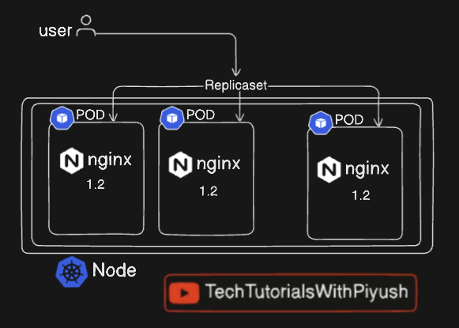
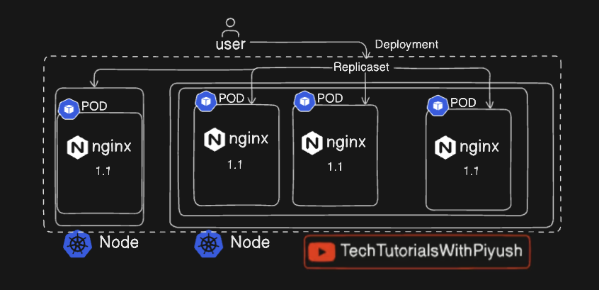

# 📘 Kubernetes Notes – Deployments, ReplicaSets & Controllers

> Personal learning notes for mastering key Kubernetes concepts like Deployments, ReplicaSets, Rollouts, and Rollbacks.

---

## 📂 Task Reference

For hands-on labs and exercises, see: `task.md`

---

## 🧠 Cheatsheets & Docs

* 🔗 [Kubectl Command Reference](https://kubernetes.io/docs/reference/kubectl/quick-reference/)
* 🔗 [ReplicaSet Concepts](https://kubernetes.io/docs/concepts/workloads/controllers/replicaset/)
* 🔗 [Deployment Concepts](https://kubernetes.io/docs/concepts/workloads/controllers/deployment/)
* 🔗 [ReplicationController Concepts](https://kubernetes.io/docs/concepts/workloads/controllers/replicationcontroller/)

---

## 📌 Concepts & CLI Reference

### 🧱 ReplicaSet



```bash
kubectl explain rs
kubectl apply -f replicaset.yaml
kubectl get rs
kubectl scale rs nginx-rs --replicas=5
kubectl describe rs <replica-set-name>
```

* Use `kubectl edit rs/nginx-rs` to update live YAML.
* ReplicaSet replaces the older `ReplicationController`.

---

### 🛠 ReplicationController (Legacy)

```bash
kubectl explain rc
kubectl get rc
kubectl apply -f rc.yaml
kubectl delete rc/nginx-rc
```

---

### 🚀 Deployment



```bash
kubectl apply -f deploy.yaml
kubectl get deploy
kubectl describe deploy <deployment-name>
kubectl get all
```

* A **Deployment** manages ReplicaSets.
* Deployment → ReplicaSet → Pod
* Allows **rolling updates** and **rollbacks** with zero downtime.

#### 🌐 Real-World Analogy

In a production app (e.g., banking), zero downtime is crucial. Deployments enable safe, staged updates. Pods are updated one at a time while others keep serving traffic.

#### 🔁 Update Image Version

```bash
kubectl set image deploy/nginx-deploy nginx=nginx:1.9.1
kubectl describe deploy/nginx-deploy
```

#### 📜 Rollout Commands

```bash
kubectl rollout status deploy/nginx-deploy
kubectl rollout history deploy/nginx-deploy
kubectl rollout undo deploy/nginx-deploy
```

#### 🧪 Dry-Run Deployment (Template Generation)

```bash
kubectl create deploy nginx-new --image=nginx --dry-run=client -o yaml > nginx-new.yaml
```

---

## 📦 Key Workflow: Deployment Lifecycle

```yaml
# Create Deployment YAML (nginx-deployment.yaml)
apiVersion: apps/v1
kind: Deployment
metadata:
  name: nginx
  labels:
    tier: backend
spec:
  replicas: 3
  selector:
    matchLabels:
      app: v1
  template:
    metadata:
      labels:
        app: v1
    spec:
      containers:
        - name: nginx
          image: nginx:1.23.0
```

### Step-by-Step

1. **Create a Deployment**

   ```bash
   kubectl apply -f nginx-deployment.yaml
   ```

2. **List and Verify Replicas**

   ```bash
   kubectl get deployments
   kubectl get pods -l app=v1
   ```

3. **Update Image to Patch Version**

   ```bash
   kubectl set image deploy/nginx nginx=nginx:1.23.4
   kubectl rollout status deploy/nginx
   ```

4. **Annotate with Change Cause**

   ```bash
   kubectl annotate deploy nginx kubernetes.io/change-cause="Pick up patch version"
   ```

5. **Scale to 5 Replicas**

   ```bash
   kubectl scale deploy nginx --replicas=5
   ```

6. **View Rollout History**

   ```bash
   kubectl rollout history deploy/nginx
   ```

7. **Rollback to Previous Revision**

   ```bash
   kubectl rollout undo deploy/nginx --to-revision=1
   ```

8. **Confirm Image Version**

   ```bash
   kubectl describe deploy nginx | grep Image
   kubectl get pods -o wide
   ```

---

## 🔍 Troubleshooting YAML Errors

### ❌ Invalid Deployment Example 1

```yaml
apiVersion: v1  # ❌ Wrong
kind: Deployment
metadata:
  name: nginx-deploy
  labels:
    env: demo
spec:
  replicas: 3
  template:
    metadata:
      name: nginx  # ❌ Not needed
      labels:
        env: demo
    spec:
      containers:
        - name: nginx
          image: nginx
          ports:
            - containerPort: 80
  selector:
    matchLabels:
      env: demo
```

✅ **Fix:**

```yaml
apiVersion: apps/v1
kind: Deployment
metadata:
  name: nginx-deploy
  labels:
    env: demo
spec:
  replicas: 3
  selector:
    matchLabels:
      env: demo
  template:
    metadata:
      labels:
        env: demo
    spec:
      containers:
        - name: nginx
          image: nginx
          ports:
            - containerPort: 80
```

---

### ❌ Label Mismatch Example

```yaml
selector:
  matchLabels:
    env: dev
template:
  metadata:
    labels:
      env: demo
```

✅ **Fix:**

```yaml
selector:
  matchLabels:
    env: demo
template:
  metadata:
    labels:
      env: demo
```

---

## 🧪 What is `--dry-run=client`?

The `--dry-run=client` flag is used to simulate a command without applying changes to the cluster.

### ✅ Benefits:

* Validate YAML syntax
* Preview objects
* Safe testing
* Useful for generating templates

### 💡 Example:

```bash
kubectl apply -f pod.yaml --dry-run=client -o yaml > pod-preview.yaml
```

This checks the pod spec and saves the generated result without creating the pod.

---

## ✅ Summary

* **ReplicaSet**: Ensures a specific number of Pods are always running.
* **Deployment**: Manages ReplicaSets and enables rolling updates and rollbacks.
* **Dry-run**: Lets you preview changes without impacting the cluster.
* **Rollout Tools**: Powerful commands to track and revert application versions.

---

