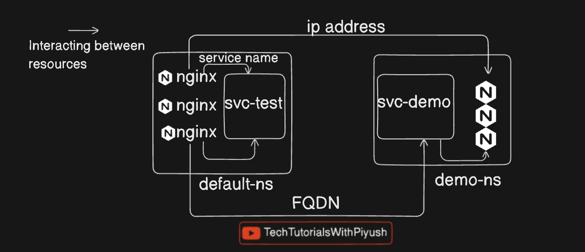

# Day 10/40 - Kubernetes Namespace Explained - CKA Full Course 2024

### What is a Namespace in Kubernetes

- Provides isolation of resources
- Avoid accidental deletion/modification
- Separated by resource type or environment or domain and so on
- Resources can access each other in the same namespace with their first name by the DNS name for other namespaces

